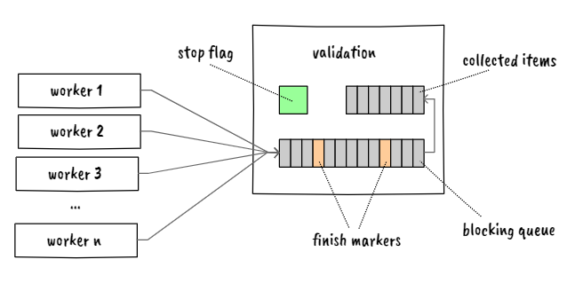

# olca-validation

This is an experimental multi-threaded database validation back-end for openLCA.
The idea is that the validation starts `n` worker threads that push validation
items (basically `error`, `warning`, and `ok` with a message) to a blocking
queue. With the blocking queue the validation synchronizes the output of the
workers into a set of collected items. When a worker is finished, it sends a
finish marker to the blocking queue. The validation is finished when it received
the `n` finish markers from the worker threads.



There is also a synchronized stop flag. Before starting a larger chunk of work a
worker should check this flag and if the flag indicates that the validation has
stopped the worker should immediately send a finish marker and stop its work.
Also, before adding an item to the queue a worker should check this flag and, if
the validation stopped, add the item followed by a finish marker and stop its
work. The stop flag is used, for example, when the validation was cancelled or
when the number of collected items exceeds a given limit.

The API of this should be easy to use:

```java
var validation = Validation.of(db)
  .maxItems(1000)
  .skipWarnings(true);
validation.run();
for (var item : validation.getItems()) {
  // ...
}
```

The following things are currently checked:

* [x] root entity fields (id, ref-ID, category, name, library links)
* [x] units and unit groups (references, duplicate unit names)
* [x] flow properties (references)
* [x] flows (references, conversion factors)
* [x] currencies (references, conversion factors)
* [x] social indicators (references)
* [x] data quality systems
* [x] processes (references, also in exchanges, allocation factors,
  social aspects)
* [x] impact categories
* [x] impact methods
* [ ] parameters, formulas
* [ ] projects
